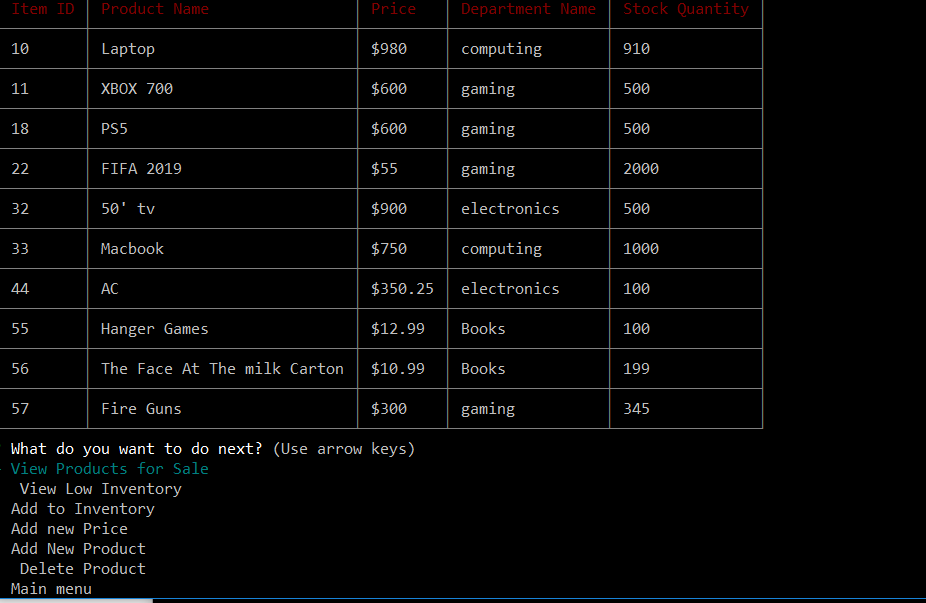
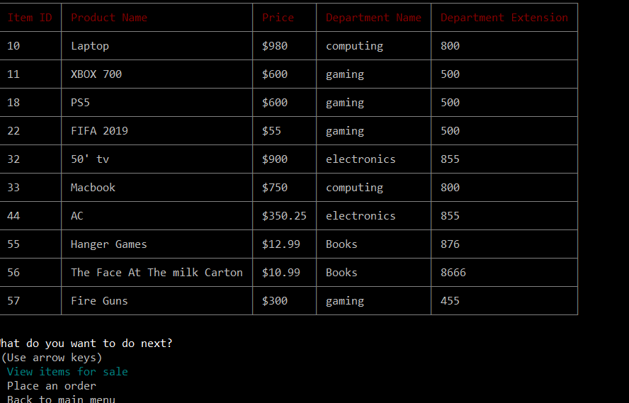

# bamazon follow the link to watch video for reference
https://drive.google.com/file/d/19lS7NBkn2JhI6ssFHfOJn8FhFChluC9b/view

##Overview
A Node.js version of Amazon. Multiple user interfaces allow users to experience various features under different identities (customer, manager and supervisor). Rooted in powerful MySQL database, user could operate a complete supply chain system within the app, from adding new products to managing department invetroy levels and adding new product.

#Guidance
To use Bamazon, please follow steps below.

Before getting started, make sure you have access to these apps:

#Terminal

#MySQL Workbench

#Clone this repository;
Open Terminal, navigate to the folder of this repository;
In command line, type npm i and press enter to install npm modules involved in this app;
In command line, type mysqld and press enter to start MySQL progress;
Open MySQL Workbench, make a connection, then paste codes in Bamazon.sql to query window and run queries;
Open Terminal and navigate to the folder of this repository, type node uploadSQL.js in command line and press enter. After everything has been updated, press ctrl + c to terminate this progress. (Notice: this step is extremely important, otherwise many values in database will be missing!)
In command line, type node bamazon.js and press enter. Enjoy it!
#Copyright
Fernando Ramirez  (C) 2018. All rights reserved.